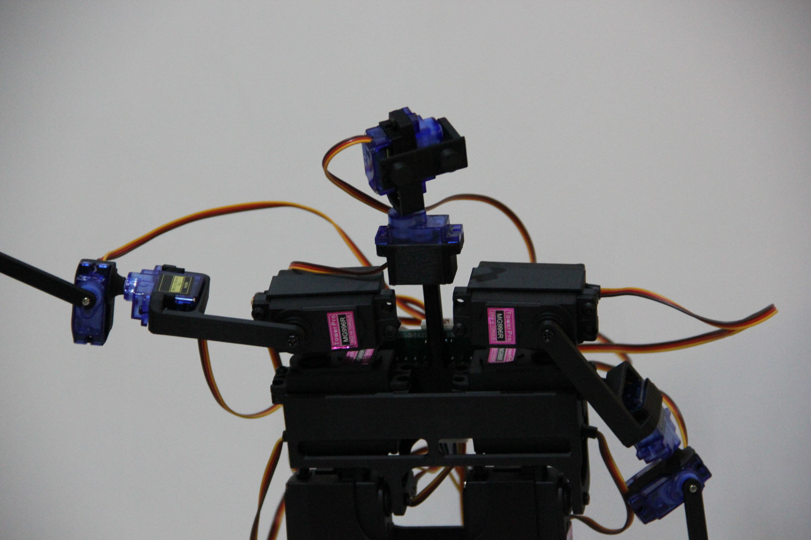
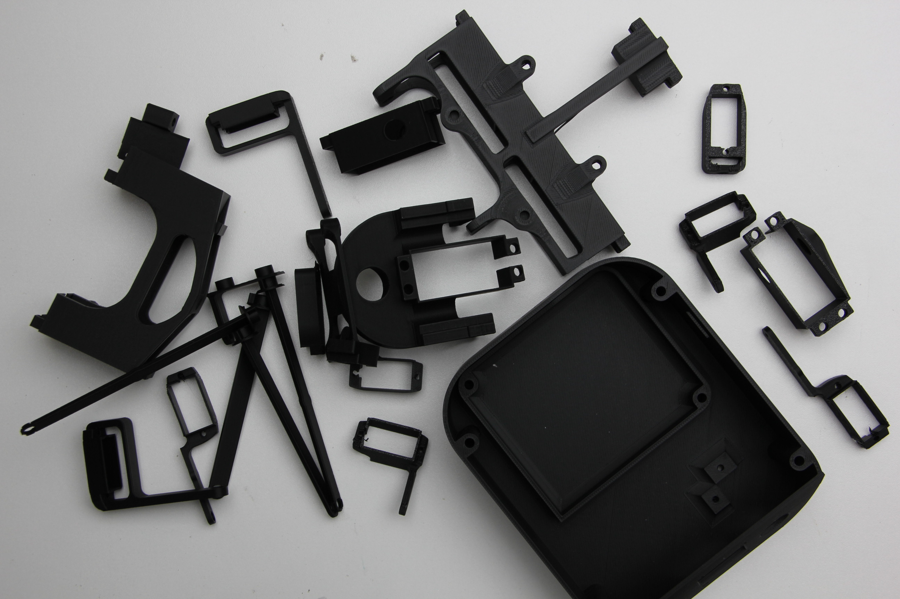
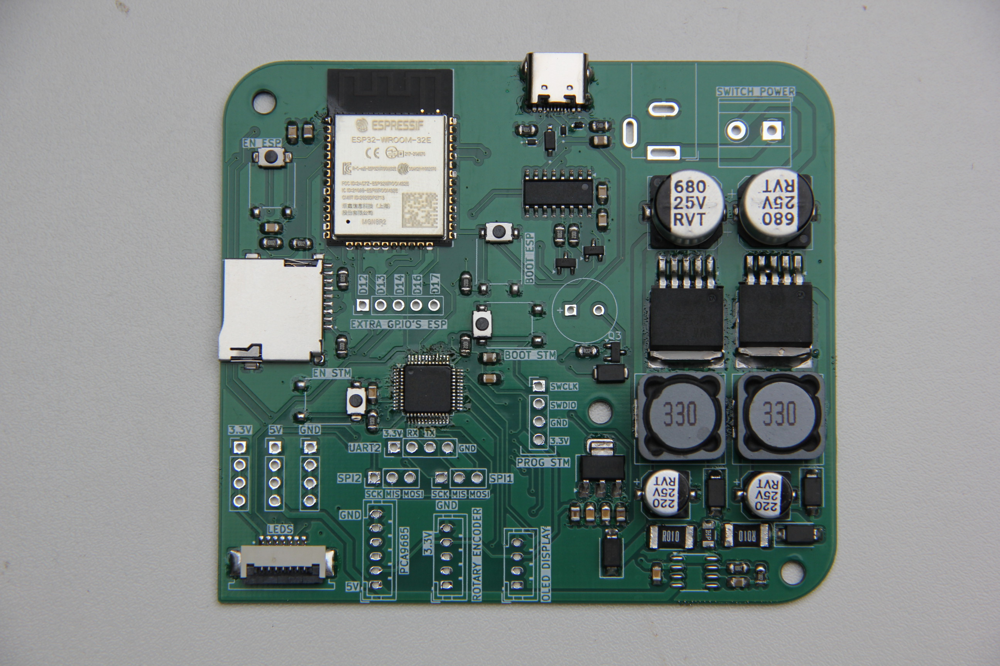
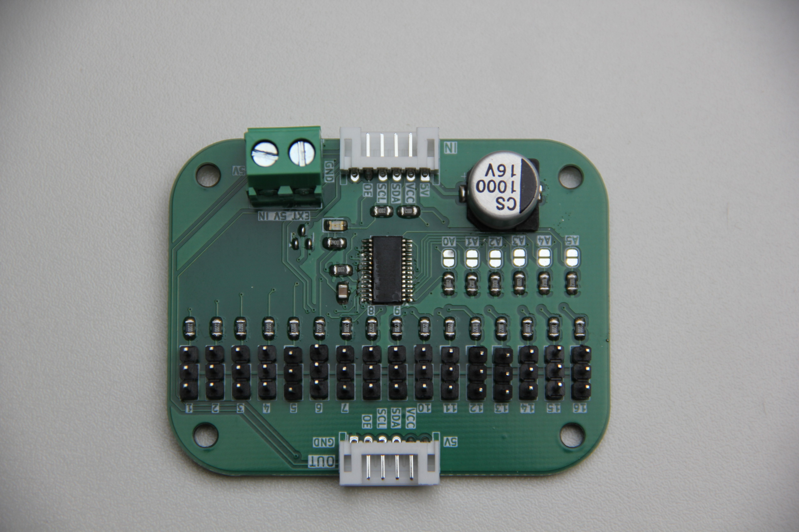
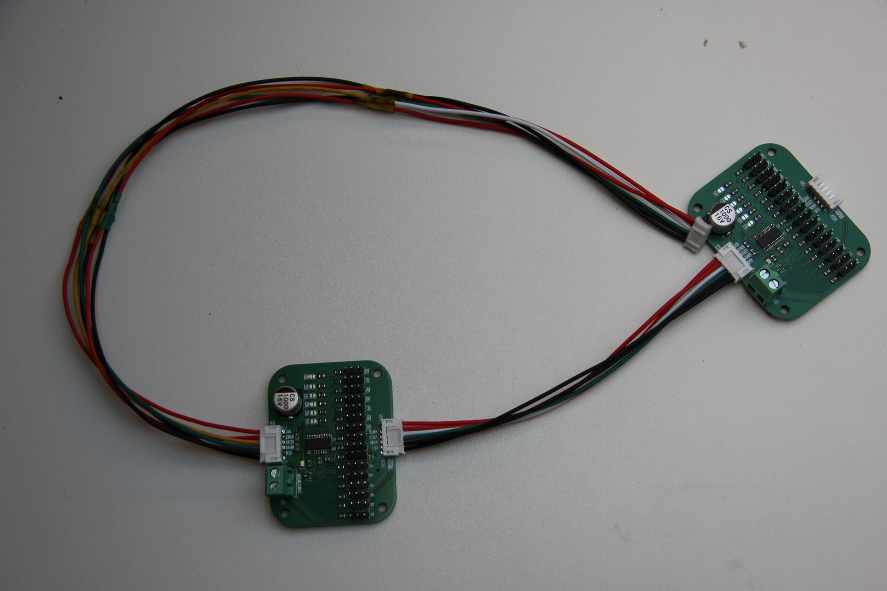
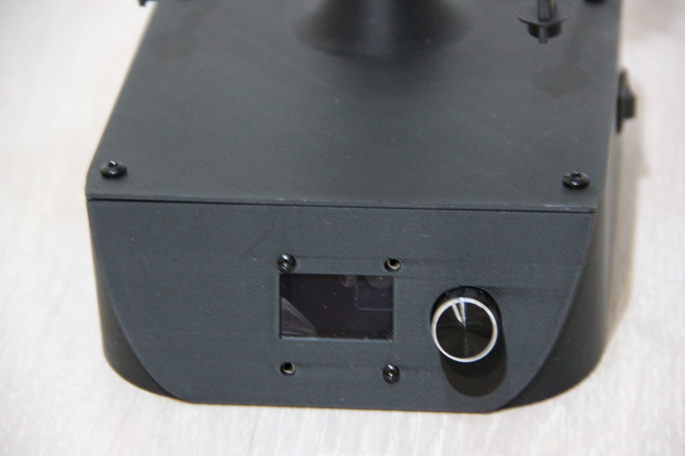

# Mini-Me

An animatronic robot that naturally mimics human movements with multiple control interfaces (UDP & Bottango)



## Hardware Overview

The system uses a dual-microcontroller architecture:
- **STM32G030C8T:** Hardware control and servo management
- **ESP32-WROOM-32E-N8:** WiFi communication and external interfaces
- **19 servo motors** controlled via 2x PCA9685 PWM drivers
- **Custom PCBs** for main control and servo distribution
- **12V power supply** with buck converter and current monitoring

## Assembly Instructions

**3D Printed Parts**
The mechanical design consists of 22 different parts, all designed in Fusion 360 for the Bambu Lab P1S printer. Print all STL files from the `/Printfiles/` directory.



**Magnet Integration**
During printing, pause the G-code at specified layers to insert magnets into the head, arms, and legs. This allows easy attachment of accessories and face variations.

**PCB Assembly**
1. Order PCBs using Gerber files in `/Pcb's/`
2. Solder components according to the provided BOMs
3. Main board includes ESP32, STM32, power management, and interfaces
4. Servo boards use JST connectors for secure servo connections




**Final Assembly**
1. Install PCBs in the base/foot assembly
2. Connect servo boards via ribbon cables

3. Mount OLED display and rotary encoder in base

4. Assemble skeleton parts with integrated magnets
5. Connect all servos to appropriate servo board positions

## Software

**Firmware**
- **ESP32:** Programmed with PlatformIO (C++)
- **STM32:** Programmed with STM32CubeIDE

**Control Applications**
- **Mobile App (Flutter):** Smartphone-based control interface via UDP
- **Bottango Integration:** Professional animation software compatibility

**Network Control**
The robot accepts UDP commands in JSON format:
```json
{"servo": 1, "angle": 90}
{"servos": [{"id": 1, "angle": 90}, {"id": 2, "angle": 45}]}
```

## Getting Started

1. **3D Print** all parts from `/Printfiles/`
2. **Order and assemble** PCBs using provided files and BOMs
3. **Flash firmware** from `/Firmware/Mini-Me-DevBoard/` and `/Firmware/MINI-ME-ESP32/`
4. **Install control software** of choice from `/Software/`
5. **Connect to WiFi** and start controlling via UDP or applications

**Project Report:** [Complete documentation available](docs/Mini-Me-Report.pdf)